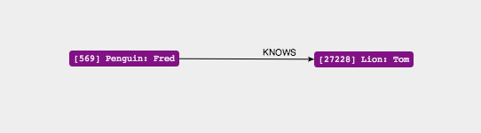
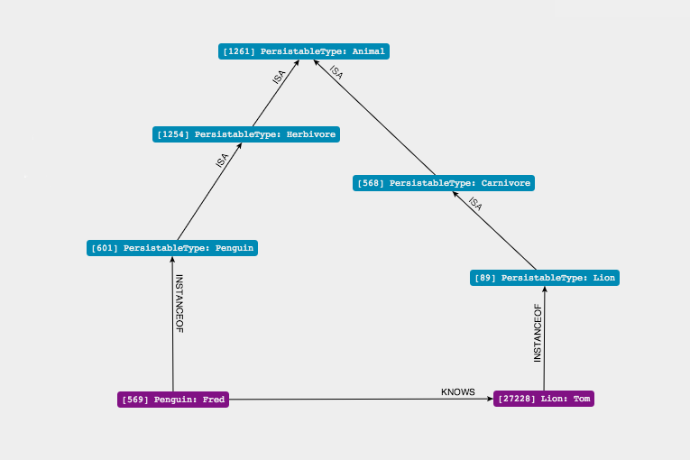

A graph based queryable object persistance framework built on top of Neo4j.

Build status
------------

.. image:: https://secure.travis-ci.org/onefinestay/kaiso.png?branch=master
   :target: http://travis-ci.org/onefinestay/kaiso

Example
-------

In addition to objects, Kaiso also stores the class information in the graph.
This allows us to use cypher to query instance information, but also to answer
questions about our types.

Let's define some basic classes

.. code:: python

    from kaiso.attributes import Integer, Outgoing, String, Uuid
    from kaiso.types import Entity, Relationship

    # define a simple type hierarchy

    class Knows(Relationship):
        pass

    class Animal(Entity):
        id = Uuid(unique=True)
        name = String()
        knows = Outgoing(Knows)

    class Carnivore(Animal):
        pass

    class Herbivore(Animal):
        pass

    class Penguin(Herbivore):
        favourite_ice_cream = String()

    class Lion(Carnivore):
        n_siblings = Integer()

As with any orm, we can make some instances and persist them in our graph

.. code:: python

    from kaiso.persistence import Manager

    manager = Manager("http://localhost:7474/db/data/")

    # create some instances

    fred = Penguin(name="Fred")
    tom = Lion(name="Tom")

    relation = Knows(fred, tom)

    manager.save(fred)
    manager.save(tom)
    manager.save(relation)

Using the Neo4j web interface to explore our graph, we find Tom and Fred:

However, in addition, we can also see the type information in the graph:

We can make use of the type information in our queries, e.g. to find all
herbivores who know a carnivore

.. code:: cypher

    START
        Herbivore=node:persistabletype(id="Herbivore"),
        Carnivore=node:persistabletype(id="Carnivore")

    MATCH
        Carnivore <-[:ISA*]-()<-[:INSTANCEOF]-(carnivore),
        Herbivore <-[:ISA*]-()<-[:INSTANCEOF]-(herbivore),

        (herbivore)-[:KNOWS]->(carnivore)

    RETURN
        "The herbivore",
        herbivore.name,
        "knows the carnivore",
        carnivore.name;

::

    ==> +---------------------------------------------------------------------+
    ==> | "The herbivore" | "Fred"      | "knows the carnivore" | "Tom"       |
    ==> +---------------------------------------------------------------------+
